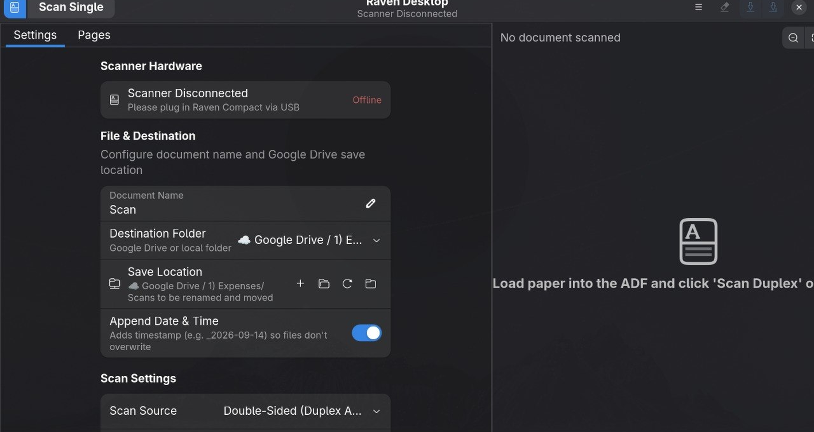

# RavenScan — Linux Desktop App for Raven Compact Scanners



**A native Linux desktop scanning app for the Raven Compact Scanner** (Avision AD215 / AD215W / AD215L) and compatible Avision scanners. Built with GTK4/Libadwaita for Linux (Arch/Omarchy and other distributions). No Raven cloud account needed — the original Raven Desktop was Electron + cloud-dependent; this talks to the hardware directly over USB.

---


## What We Discovered & Reverse-Engineered

1. **Hardware Architecture:**
   - **OEM Platform:** Manufactured by **Avision, Inc.** (model family **AD215 / AD215W / AD215L**, internal engine `CAD215UV`).
   - **USB IDs:** Vendor ID `0x0638`, Product ID `0x3200` (`Compact_WiFi`) or `0x2FFF` (`Compact_USB`).
   - **Protocol:** Avision SCSI-over-USB Bulk transfer (`0x02` Bulk OUT, `0x81` Bulk IN, `0x83` Interrupt IN).
   - **Capabilities:** Dual CIS sensors (true hardware duplex single-pass scanning), automated document feeder (ADF), dedicated ID card slot, 600 DPI optical resolution.

2. **Software Analysis:**
   - The original Raven Desktop application was an Electron app tied to Dynamsoft Web TWAIN and proprietary cloud servers (which ceased operating in December 2023).
   - Recovered original driver links and downloaded full macOS (`Raven-A-Driver-latest.pkg`) and Windows (`Raven_Compact_Windows.zip`) driver archives directly from Raven's production storage bucket for archival.
   - Recovered Raven's native C++ hardware interaction sources (`scanner.cpp`, `scanner.h`, `AsyncEmitter.cpp`).

---

## Application Features

- **Omarchy Native Integration:** Built with GTK 4 and Libadwaita, matching your system's dark theme, Wayland compositor, and desktop styling.
- **Feeder & Duplex Support:** One-click duplex scanning (both sides simultaneously) or single-sided simplex scanning.
- **Resolution Control:** 150 DPI (Fast Draft), 200 DPI (Standard), 300 DPI (High Quality), and 600 DPI (Ultra Detail).
- **Color Modes:** 24-bit Color, 8-bit Grayscale, and 1-bit Black & White Lineart.
- **Page Management:**
  - Visual thumbnail strip with page badges (Front / Back).
  - High-resolution preview with zoom in, zoom out, and fit-to-view.
  - Reorder pages, rotate 90° clockwise/counter-clockwise, or delete pages.
- **Multi-Page Export:**
  - Multi-page PDF generation.
  - Integrated **Tesseract OCR** for searchable text layer.
  - Automatic deskewing of tilted sheets.
  - Export to standard directory: `~/Documents/Scans/`.
  - One-click "Open Saved PDF" in your default document viewer.
- **Hardware Status Monitoring:** Real-time USB polling detecting connection and permission states.

---

## How to Launch

### 1. Application Launcher
Press your `Super` key and type **Raven Desktop** in the Omarchy menu.

### 2. Terminal
Run:
```bash
ravenscan
```

---

## USB Permissions (One-Time Setup)

Linux restricts raw USB communication for non-root users by default. To grant your user account access to the scanner hardware, run:

```bash
~/.local/share/ravenscan/setup_permissions.sh
```

Or run this single command:
```bash
echo 'SUBSYSTEM=="usb", ATTR{idVendor}=="0638", ATTR{idProduct}=="3200", MODE="0666", GROUP="scanner", TAG+="uaccess"' | sudo tee /etc/udev/rules.d/99-raven-scanner.rules && sudo udevadm control --reload-rules && sudo udevadm trigger
```

Once executed, Raven Desktop will automatically detect the scanner as **Ready** and let you scan directly to searchable PDFs!

---

## Scanner Driver (required): patched SANE `avision` backend

Stock SANE does not work with the Raven Compact (`0638:3200`). The scanner leaves its
"scanner type" and "duplex" capability bits blank, so stock SANE treats it as a one-sided
flatbed. Scans then stall, the device drops off USB, and front and back get mixed into one image.
`sane-avision-patch/` contains the fix, built against sane-backends **1.4.0**:

- `raven-compact-avision.patch`: the patch against upstream `backend/avision.c`
- `libsane-avision.so.1.4.0`: prebuilt backend (x86_64, sane-backends 1.4.0)
- `NOTES.md`: full investigation notes

Install the prebuilt backend (back up the original first):

```bash
sudo cp /usr/lib/sane/libsane-avision.so.1.4.0 /usr/lib/sane/libsane-avision.so.1.4.0.orig
sudo cp sane-avision-patch/libsane-avision.so.1.4.0 /usr/lib/sane/libsane-avision.so.1.4.0
```

What the patch changes (all scoped to `0638:3200` except the generic robustness fixes):
- Adds the device to the model table and forces sheetfed + interlaced duplex mode
- Skips the accessory probe this unit rejects
- Handles a CHECK CONDITION status byte in the data phase by requesting sense instead of resending forever
- Shorter USB timeouts and more retries; the cmd-write retry loop no longer bails early
- Closes the reader pipe on start-scan errors, so the batch ends cleanly at "feeder empty" instead of hanging
- Sends "release paper" after each sheet so the page is fully ejected

**Scan at 300 DPI or higher.** Below 300 the paper feeds too fast and the rear sensor's color
data corrupts. The app always scans at 300 or higher and downsamples when a lower DPI is chosen.
